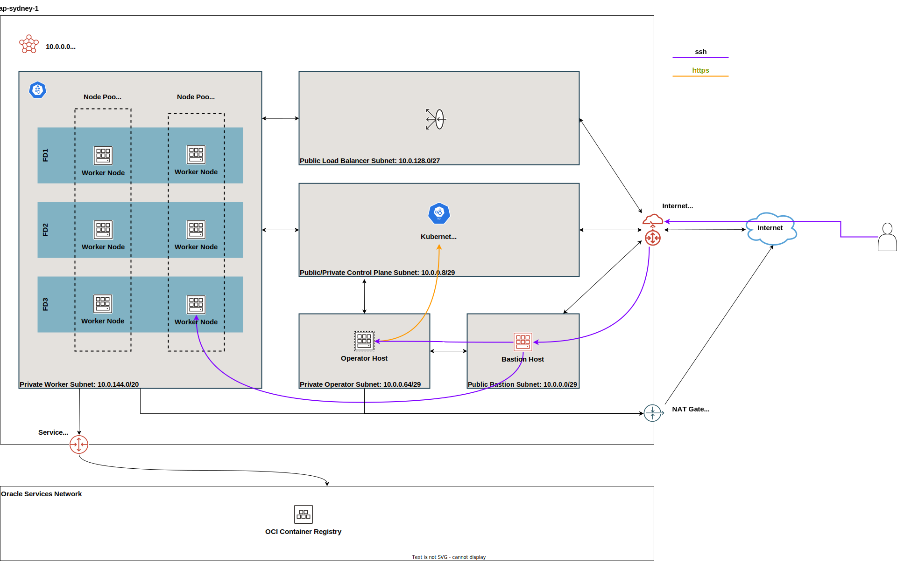
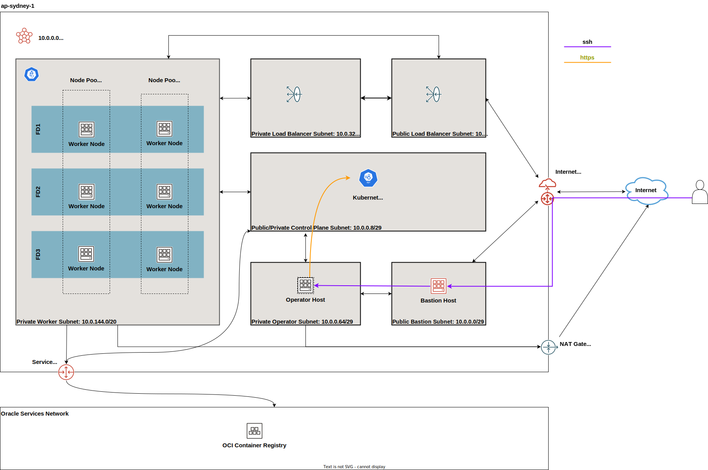

# Topology

The following resources are created by default:

* 1 VCN with Internet, NAT and Service Gateways
* Route tables for Internet, NAT and Service Gateways
* 1 regional public subnet for the bastion host along with its security list
* 1 regional private subnet for the operator host along with its NSG
* 1 public control plane subnet
* 1 private regional worker subnet
* 1 public regional load balancer
* 1 bastion host
* 1 operator host
* 1 public Kubernetes Cluster with private worker nodes
* 1 Network Security Group (NSG) for each of control plane, workers and load balancers

```admonish notice
The Kubernetes Control Plane Nodes run in Oracle's tenancy and are not shown here.

Although the recommended approach is to now deploy private clusters,***we are currently keeping the default setting to public***. This is to give our users the time to adjust other configurations e.g. their CI/CD tools.
```

The Load Balancers are only created when Kubernetes services of type *LoadBalancer* are deployed or you manually create Load Balancers yourself.

The diagrams below depicts the default deployment in multi-AD regions:

[  ](../images/defaultmad-large.svg)
*Figure 1: Multi-AD Default Deployment*

and single-AD regions:

[  ](../images/defaultsad-large.svg)
*Figure 2: Single-AD Default Deployment*

```admonish notice
The node pools above are depicted for illustration purposes only. By default, the clusters are now created without any node pools.
```

****
## Networking and Gateways

[  ](../images/networking-large.svg)
*Figure 3: Networking and Gateways*

The following subnets are created *by default*:

* 1 public regional control plane subnet: this subnet hosts an endpoint for the Kubernetes API server publicly accessible from the Internet. Typically, only 1 IP address is sufficient if you intend to host only 1 OKE cluster in this VCN. However, if you intend to host many OKE or Kubernetes clusters in this VCN and you intend to reuse the same subnets, you need to increase the default size of this subnet.
* 1 private regional worker subnet: this subnet hosts the worker nodes where your workloads will be running. By default, they are private. If you need admin access to the worker nodes e.g. SSH, you'll need to enable and use either the bastion host or the OCI Bastion Service.
* 1 public regional load balancer subnet: this subnet hosts your OCI Load Balancer which acts as a network ingress point into your OKE cluster.
* 1 public regional bastion subnet: this subnet hosts an optional bastion host. See additional documentation on the purpose of the bastion host. 
* 1 private regional operator subnet: this subnet hosts an optional operator host that is used for admin purposes. See additional documentation on the purpose of the operator host

```admonish warning
Do not confuse the bastion host with the OCI Bastion Service.
```

The bastion subnet is regional i.e. in multi-AD regions, the subnet spans all Availability Domains. By default, the bastion subnet is assigned a CIDR of `10.0.0.0/29` giving a maximum possible of 5 assignable IP addresses in the bastion subnet.

The workers subnet has a CIDR of `10.0.144.0/20` assigned by default. This gives the subnet a maximum possible of 4093 IP addresses. This is enough to scale the cluster to the maximum number of worker nodes (2000) currently allowed by Oracle Container Engine.

The load balancer subnets are of 2 types:
* public
* private

By default, only the public load balancer subnet is created. See [Public and Internal Load Balancers](#public-vs-internal-load-balancers) for more details. The private load balancer subnet has a CIDR of `10.0.32.0/27` whereas the public load balancer subnet has a CIDR of `10.0.128.0/27` assigned by default. This allows both subnets to assign a maximum of 29 IP addresses and therefore 9 load balancers can be created in each. You can control the size of your subnets and have more load balancers if required by adjusting the newbit and netnum values for the `subnets` parameter.

The `subnets` parameter govern the boundaries and sizes of the subnets. If you need to change the default values, refer to the [Networking Documentation](./network_subnets.md#create-new-subnets-forced) to see how. We recommend working with your network administrator to design your network. The following additional documentation is useful in designing your network:
* [Erik Berg on Networks, Subnets and CIDR](https://erikberg.com/notes/networks.html)
* [Terraform cidrsubnet documentation](https://www.terraform.io/docs/configuration/functions/cidrsubnet.html)

The following gateways are also created:

* Internet Gateway: this is required if the application is public-facing or a public bastion host is used
* NAT Gateway if deployed in [private mode](#public-vs-private-worker-nodes)
* Service Gateway: this is required for connectivity between worker nodes and the control plane

The Service Gateway also allows OCI cloud resources without public IP addresses to privately access Oracle services and without the traffic going over the public Internet. Refer to the [OCI Service Gateway documentation](https://docs.cloud.oracle.com/iaas/Content/Network/Tasks/servicegateway.htm) to understand whether you need to enable it.

****
## Bastion Host

[  ](../images/bastion-large.svg)
*Figure 4: Networking and Gateways*

The bastion host is created in a public regional subnet. You can create or destroy it anytime with no effect on the Kubernetes cluster by setting the `create_bastion_host = true` in your variable file. You can also turn it on or off by changing the `bastion_state` to `RUNNING` or `STOPPED` respectively.

By default, the bastion host can be accessed from anywhere. However, you can restrict its access to a defined list of CIDR blocks using the `bastion_access` parameter. You can also make the bastion host private if you have some alternative connectivity method to your VCN e.g. using VPN.

You can use the bastion host for the following:

* SSH to the worker nodes
* SSH to the operator host to manage your Kubernetes cluster

To SSH to the bastion, copy the command that terraform outputs at the end of its run:

```properties
ssh_to_bastion = ssh -i /path/to/private_key opc@bastion_ip
```

To SSH to the worker nodes, you can do the following:

```shell
ssh -i /path/to/private_key -J <username>@bastion_ip opc@worker_node_private_ip
```

```admonish tip
If your private ssh key has a different name or path than the default `~/.ssh/id_*` that ssh expects e.g if your private key is `~/.ssh/dev_rsa`, you must add it to your ssh agent:
```

```shell
eval $(ssh-agent -s)
ssh-add ~/.ssh/dev_rsa
```

****

## Public vs Private Clusters

When deployed in public mode, the Kubernetes API endpoint is publicly accessible.

[  ](../images/publiccluster-large.svg)
*Figure 5: Accessing a public cluster*

.Accessing the Kubernetes API endpoint publicly
image::images/publiccluster.png[align="center"]

You can set the Kubernetes cluster to be public and restrict its access to the CIDR blocks A.B.C.D/A and X.Y.Z.X/Z by using the following parameters:
```properties
control_plane_is_public     = true # *true/false
control_plane_allowed_cidrs = ["A.B.C.D/A","X.Y.Z.X/Z"]
```

When deployed in private mode, the Kubernetes endpoint can only be accessed from the operator host or from a defined list of CIDR blocks specified in `control_plane_allowed_cidrs`. This assumes that you have established some form of connectivity with the VCN via VPN or FastConnect from the networks listed in `control_plane_allowed_cidrs`.

[  ](../images/publiccluster-large.svg)
*Figure 5: Accessing the Kubernetes API endpoint from the operator host*

The following table maps all possible cluster and workers deployment combinations:

| Workers/control plane | public | private |
| --------------------  | :------: | :-------: |
| worker_type=public    |    X     |    X      |
| worker_type=private   |    X     |    X      |

```admonish important
We strongly recommend you use private clusters.
```

## Public vs Private worker nodes

### Public workers

[  ](../images/publicworkers-large.svg)
*Figure 6: Deploying public workers*


When deployed in public mode, all worker subnets will be deployed as public subnets and route to the Internet Gateway directly. Worker nodes will have both private and public IP addresses. Their private IP addresses will be from the range of the worker subnet they are part of whereas the public IP addresses will be allocated from Oracle's pool of public IP addresses.

If you intend to use Kubernetes NodePort services on your public workers or SSH to them, you must explicitly enable these in order for the security rules to be properly configured and allow access:

```
allow_node_port_access  = true
allow_worker_ssh_access = true
```

```admonish danger
Because of the increased attack surface area, we ***do not*** recommend running your worker nodes publicly. However, there are some valid use cases for these and you have the option to make this choice.
```

### Private workers

[  ](../images/privateworkers-large.svg)
*Figure 7: Deploying public workers*

When deployed in private mode, the worker subnet will be deployed as a private subnet and route to the NAT Gateway instead. This considerably reduces the surface attack area and improves the security posture of your OKE cluster as well as the rest of your infrastructure.

```admonish tip
We ***strongly*** recommend you run your worker nodes in private mode.
```

Irrespective of whether you run your worker nodes publicly or privately, if you ssh to them, you must do so through the bastion host or the OCI Bastion Service. Ensure you have enabled the [bastion host](./bastion.md#example-usage).

## Public vs. Internal Load Balancers

[  ](../images/loadbalancers-large.svg)
*Figure 8: Using load balancers*

You can use both public and internal load balancers. By default, OKE creates public load balancers whenever you deploy services of type *LoadBalancer*. As public load balancers are allocated public IP addresses, they require require a public subnet and the default service load balancer is therefore set to use the public subnet *pub-lb*.

You can change this default behaviour and use internal load balancers instead. Internal load balancers have only private IP addresses and are not accessible from the Internet. Although you can place internal load balancers in public subnets (they just will not be allocated public IP addresses), we recommend you use a different subnet for internal load balancers.

Depending on your use case, you can also have both public and private load balancers.

Refer to the user guide on [load balancers](./loadbalancers.md) for more details.

### Using Public Load Balancers

When creating a service of type *LoadBalancer*, you *_must_* specify the list of NSGs using OCI Load Balancer annotations e.g.:

```yaml
apiVersion: v1
kind: Service
metadata:
  name: acme-website
  annotations:
    oci.oraclecloud.com/oci-network-security-groups: "ocid1.networksecuritygroup...."
    service.beta.kubernetes.io/oci-load-balancer-security-list-management-mode: "None"
spec:
  type: LoadBalancer
  ....
```

```admonish note
Since we have already added the NodePort range to the public load balancer NSG, you can also disable the security list management and set its value to `"None"`.
```

### Using Internal Load Balancers

When creating an internal load balancer, you must ensure the following:
* `load_balancers` is set to `both` or `internal`.

Setting the `load_balancers` parameter to `both` or `internal` only ensures the private subnet for internal load balancers and the required NSG is created. To set it as the default subnet for your service load balancer, set the `preferred_load_balancer` to `internal`. In this way, if you happen to use both types of Load Balancers, the cluster will preference the internal load balancer subnets instead.

```admonish important
Even if you set the `preferred_load_balancer` to `internal`, you still need to set the correct service annotation when creating internal load balancers. Just setting the subnet to be private is **_not_** sufficient e.g.
```

```yaml
service.beta.kubernetes.io/oci-load-balancer-internal: "true"
```

Refer to [OCI Documentation](https://docs.cloud.oracle.com/iaas/Content/ContEng/Tasks/contengcreatingloadbalancer.htm#CreatingInternalLoadBalancersinPublicandPrivateSubnets) for further guidance on internal load balancers.

### Creating LoadBalancers using IngressControllers

You may want to refer to the following articles exploring Ingress Controllers and Load Balancers for additional information:

- [Experimenting with Ingress Controllers on Oracle Container Engine (OKE) Part 1](https://medium.com/oracledevs/experimenting-with-ingress-controllers-on-oracle-container-engine-oke-part-1-5af51e6cdb85)
- [[Experimenting with Ingress Controllers on Oracle Container Engine (OKE) Part 1]](https://medium.com/oracledevs/experimenting-with-ingress-controllers-on-oracle-container-engine-oke-part-2-96063927d2e6)